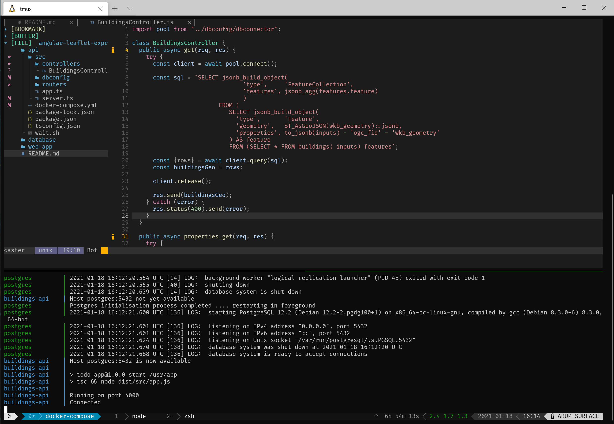

# Functionality Overview of the System

### I developed this to demo that given a  GeoJson for buildings how we can analyse the data using both data table and well as  plotting a map against those data visibly identifying them using markers and layers. 


### You can see the layers when you zoom into the map


### This is also interactive in so far such that you may choose to edit and/or delete the properties of the building

As you can see I can change the Area of 441 W 37 ST from 155.72 to 165.72


As you can see that change is applied to the above table. Obviously geometry cannot be changed and hence no change appears onto the map.


Importantly the change is persisted onto the backend database. See before and after snapshot on pgAdmin


This is after the Update


If you however choose to delete the building then it disappears from the table and also the map gets updated. Clearly the map get updated because the GEO data specific to building was deleted from the db. This can be verified from the below snapshots. Technically this is achieved through event multicasting (due to ease of implementation ). However had this been a production application probably I would have advised to adhere to `Single Source of Truth` patern achievable through various time tested libraries like redux etc. 


## Getting Started

### Prerequisites

#### Docker, Node.js 12+ (versions below could work, but are not tested)

### Installing

1. Clone the repository

   ```
   git clone https://github.com/arupdvsa/angular-leaflet-express-postgis.git
   ```
2. Start the backend
	```
	cd api
	docker-compose up --build 	
	```
	Docker container for the api  will wait for postgres to startup after the postgis extensions are installed and the dbinit is executed which has a pg_dump of the original geoJson file which I imported originally from the file using the ogr2ogr utility. Once the docker postgress is ready, the api server will become available on port 4000. Please use the below snapshot for your reference
	

3. Testing the postgres and buildings-api
	```
   Check postgres on docker using pgadmin at  http://localhost:8080/
	 credentials are available in the docker-compose.yml
	 check the api using curl or postman as per your preference for example
	```
	```
	 curl 'http://localhost:4000/buildings/properties' | json_pp 
	```
	```
	echo '{"address": "518 6 Avenue", "city": "New York", "country": "USA", "roof_material": "some material", "roof_type": "curved", "area": "234", "storeys": "4", "height": "34" }' | curl -d @- http://localhost:4000/buildings/properties/1 --header "Content-Type:application/json" -X PUT
	```

4.	Start the Frontend
	```
	cd web-api
	yarn/npm (as per your preference) install
	yarn start
	```
5. Tips for resetting the backend server database.
	You may need to reset the data to original after having deleted some data from the UI. If that is the case then you may follow these easy steps
	```
	docker-compose down --remove-orphans
	rm -rf ../database/postgresdata 
	docker-compose up --build 
	``` 